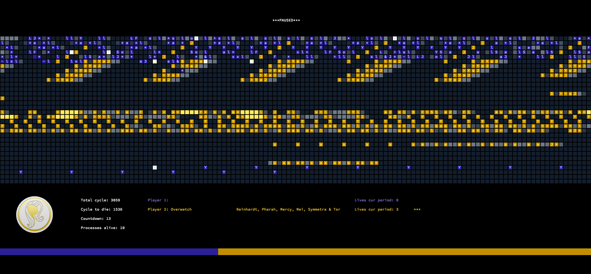

# corewar
A 42 project implementing an assembler, virtual machine, and visualizer I worked on with Liam Dehaudt and Conan Wu

## Build

On a Mac: Run `make` in the main project directory.

To run the assembler: From the main directory, run `./asm/asm chmps/your_champ.s`. It will produce a `your_champ.cor` file, which can be fed into the main corewar executable.

Run the `corewar` executable from the `visualizer` folder without arguments to see usage information. One example:

`./visualizer/corewar cor/Gagnant.cor cor/jumper.cor`

You can run up to 4 champions in the same arena, and the visualizer will run until one champion achieves victory. Spacebar to pause, preassembled champions are in the `cor` folder

## Project information

We carefully parsed a given set of instructions and opaque sample header file to recreate the desired behavior for 16 assembly instructions and translate them into bytecode executable by our virtual machine. The goal of corewar is to create a virtual arena for up to 4 champions (written in assembly but represented most accurately by My Little Pony characters) to compete for supremacy. For the full experience, viewing is recommended, but a quiet mode is included for those who would rather just know the outcome.

### Assembler

The `asm` executable parses `.s` assembly files into `.cor` binaries executable by the virtual machine. The opcodes themselves are nothing remarkable; unfortunately, the specification beyond that was a little bit vague. There can be an additional byte representing the type of arguments: register, indirect, or direct value, and the values themselves can be 2 or 4 bytes. After observing the output from a number of champions, we reverse engineered a provided assembler binary to create our own which produced identical output.

### Virtual Machine

The virtual machine operates in a 4096-byte circular virtual address space. Different operations take different amounts of time, there is no protected memory that cannot be overwritten, and the actions of every program counter at each time step are resolved in series but in a consistent manner. The goal of each champion is to overwrite the memory of all other champions; however, each process executes any instruction it passes, although it owns an independent set of registers. Thus, it is possible for your own code to benefit other champions: the only unique piece of information each champion possesses is its own unique champion ID in register 0 at the beginning of execution. This is mostly irrelevant, but it really does make for some interesting strategies that can be quite fun to watch. Fun can be  important when you're carefully observing two simultaneous programs for any difference in execution.

### Visualizer

Critical! Of course, you can debug by just dumping the memory from the virtual address space at fixed time points and compare it, but the ability to step through and watch the program counters move was quite nice. It's also true that the end product is infinitely more enjoyable with a fun pony-based visualizer. Different forms of representing the address space were considered to further emphasize its circular nature, but ultimately a wide rectangle was the easiest to follow.
